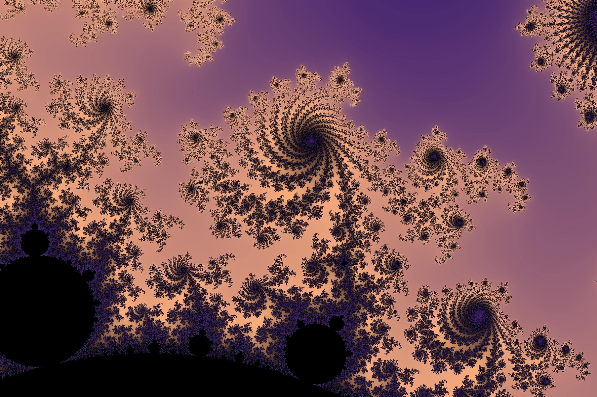

# Mandelbrot

Create an image of the mandelbrot set

## Usage

```console
$ python3 -m mandelbrot --help
Usage: python -m mandelbrot [OPTIONS]

  Compute and colorize the mandelbrot set around a certain point

Options:
  -w, --width INTEGER       Width of the output image  [default: 1500]
  -h, --height INTEGER      Height of the output image  [default: 1000]
  -rc, --real-center FLOAT  Real part of the center point  [default: -0.7106]
  -ic, --imag-center FLOAT  Imaginary part of the center point  [default:
                            0.246575]
  -rw, --real-width FLOAT   wiew width of the set  [default: 0.0084]
  -m, --max-iter INTEGER    Maximum iterations per point  [default: 1500]
  -s, --seed INTEGER        Seed for the colorgradient, -1 means the default
                            colormap, 0 a random seed, or the seed number
                            [default: 0]
  -o, --out PATH            output image path  [default: images/mandel.jpg]
  --help                    Show this message and exit.
```

## Installing dependencies

```console
$ pip3 install -r requirements.txt
```

## Examples

---

```console
$ python3 -m mandelbrot -w 3000 -h 2000 -s -1 -o images/Example1.jpg
```



---

```console
$ python3 -m mandelbrot -w 3000 -h 2000 -rc -0.170337 -ic -1.06506 -rw 0.1 -s -1 -o images/Example2.jpg
```

